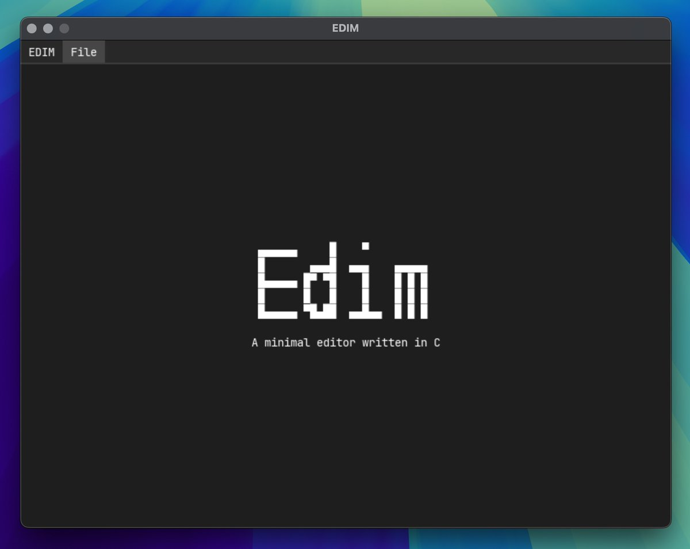

## EDIM
A minimal text editor written in C.

### Screenshots


> [!Warning]
This project is currently in early development.

--- 
### Installation
pre-compiled and packaged releases for mac (dmg) / windows (exe) /linux (.tar.gz) can be downloaded directly from **[Releases](https://github.com/mufeedcm/edim/releases)**

---

### Build

#### Prerequisites 
- any c compiler
- cmake

--- 

to build and package, run
```bash
make package
```
the output will be available at build/release/

---
### Todo

- fix filename for default saving.
- add copy and paste.
- fix resourse intensive text rendering.
- add vim mode support.
- add tab scrolling.
